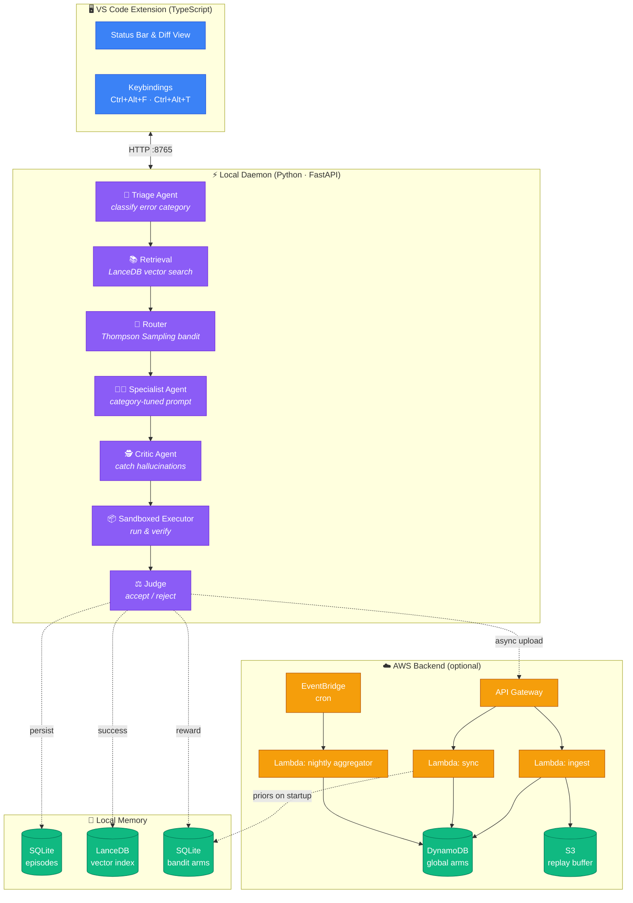

<div align="center">


# mlfix

### 🧠 A multi-agent AI pipeline for fixing Python & ML code, shipped as a VS Code extension.

**Local-first. Learns from your feedback. Optional cloud sync with AWS.**

[📥 Download `.vsix`](https://github.com/Raghava2004-cpu/mlfix.ai/releases/latest) &nbsp;·&nbsp;
[🐛 Report a bug](https://github.com/Raghava2004-cpu/mlfix.ai/issues) &nbsp;·&nbsp;
[💡 Request a feature](https://github.com/Raghava2004-cpu/mlfix.ai/issues) &nbsp;·&nbsp;
[⭐ Star the repo](https://github.com/Raghava2004-cpu/mlfix.ai/stargazers)

<br />

<!-- BADGES -->


<br />


</div>

<br />

---

<div align="center">

## 🎬 See it in action


*Select buggy code → hit `Ctrl+Alt+F` → pipeline runs → diff appears → accept or reject.*

</div>

<br />

---

## 📖 What is mlfix?

Generic AI code fixers guess. **mlfix runs a pipeline.**

Instead of throwing one prompt at one model and hoping, mlfix uses a **6-stage multi-agent flow**: triage the error, retrieve similar past fixes from vector memory, route to the specialist tuned for that error class, review the fix for hallucinations, actually **run it in a sandbox**, and only then show you the result.

A **Thompson Sampling bandit** learns which model wins per error category over time. An **optional AWS backend** aggregates anonymized episodes across users so new installs start warm instead of cold.

<br />

## ✨ Why the design is different

<table>
<tr>
<td width="50%">

**🎯 Multi-agent, not multi-prompt**

Shape mismatches, CUDA OOM, dependency conflicts, and NaN losses need different reasoning. Each has a dedicated specialist prompt.

</td>
<td width="50%">

**🎰 Bandit-based routing**

Thompson Sampling with Beta(α, β) priors picks the model most likely to succeed *for this category*. Cheap models win easy problems.

</td>
</tr>
<tr>
<td width="50%">

**🔒 Local-first, private by default**

Your data lives in `~/.mlfix/`. Cloud sync is opt-in and only uploads a SHA-256 hash of your code — never the raw source.

</td>
<td width="50%">

**🧪 Verified, not guessed**

Fixes are executed in a sandboxed subprocess with a timeout. If it doesn't run, it doesn't ship to you.

</td>
</tr>
</table>

<br />

---

## 🏗️ Architecture



<br />

---

## 🚀 Quick start

### Prerequisites

| Tool | Version |
|------|---------|
| 🟢 Node.js | 20+ |
| 🐍 Python | 3.11+ |
| ⚡ [uv](https://astral.sh/uv) | latest |
| 🔑 [Gemini API key](https://aistudio.google.com/app/apikey) | free tier |
| ☁️ AWS account *(optional)* | with CDK bootstrapped |

### Install

```bash
git clone https://github.com/Raghava2004-cpu/mlfix.ai.git
cd mlfix.ai

# 1. Set up the daemon
cd daemon
uv sync
cp .env.example .env
# Edit .env → paste your GEMINI_API_KEY

# 2. Set up the extension
cd ../extension
npm install
```

### Run

Open `extension/` in VS Code → press **F5** → a dev host launches with mlfix loaded.

| Keybind | Action |
|---------|--------|
| `Ctrl+Alt+F` | Fix selected code (paste error) |
| `Ctrl+Alt+T` | Fix using error highlighted in terminal |
| Click `mlfix` in status bar | Open command menu |

### Or install the pre-built `.vsix`

```bash
# Download the latest release
gh release download --repo Raghava2004-cpu/mlfix.ai --pattern '*.vsix'

# In VS Code: Extensions panel → ... → Install from VSIX → pick the file
```

<br />

---

## 🧬 The pipeline in detail

<details open>
<summary><b>1. 🔎 Triage — categorize the error</b></summary>

Fast rule-based patterns first (regex matches for shape mismatches, CUDA OOM, `ModuleNotFoundError`, etc.). Only ambiguous cases hit an LLM. Categories drive everything downstream:

`shape_mismatch` · `cuda_oom` · `dependency` · `data_leakage` · `training_dynamics` · `syntax` · `import` · `type` · `generic`

</details>

<details>
<summary><b>2. 📚 Retrieve — pull similar past fixes</b></summary>

LanceDB vector search with `all-MiniLM-L6-v2` embeddings. Only *accepted, verified* past fixes are indexed — failed attempts don't pollute retrieval. Top-3 examples are inlined into the specialist prompt as few-shot references.

</details>

<details>
<summary><b>3. 🎰 Router — Thompson Sampling picks a model</b></summary>

For each (category, model) pair we maintain Beta(α, β) posteriors on success rate. On each request we sample from each candidate arm and pick the argmax. Successes bump α, failures bump β. Budget-aware fallback: if the top choice is over its daily token cap, we drop to the next.

</details>

<details>
<summary><b>4. 🧑‍🔬 Specialist — category-tuned prompt</b></summary>

Each category has its own system prompt. The `cuda_oom` specialist knows the escalation ladder (batch size → grad accumulation → mixed precision → gradient checkpointing). The `data_leakage` specialist knows to look for scalers fit before the train/test split. Etc.

</details>

<details>
<summary><b>5. 🕵️ Critic — catch hallucinations</b></summary>

A stronger model reviews the fix: hallucinated APIs, introduced bugs, does the fix even address the reported error. Can approve, reject, or patch.

</details>

<details>
<summary><b>6. 📦 Executor — actually run it</b></summary>

Runs the fix in a subprocess with a hard timeout. Only for snippets that look safe (no file I/O, no network, no CUDA). If the subprocess exits 0, the judge trusts execution over the critic.

</details>

<details>
<summary><b>7. ⚖️ Judge — final verdict</b></summary>

Deterministic. No LLM. Combines critic verdict + execution result → success/failure + reward for the bandit.

</details>

<br />

---

## 📊 What's tracked

| Signal | Where |
|---|---|
| Every fix attempt (win/loss) | SQLite: `~/.mlfix/mlfix.db` |
| Accepted fixes as few-shot | LanceDB: `~/.mlfix/lancedb/` |
| Daily tokens per model | SQLite, enforced against free-tier caps |
| Bandit arm posteriors | SQLite, updated on judge + user feedback |
| Global priors (opt-in) | AWS DynamoDB, aggregated nightly |

<br />

---

## ☁️ Deploy the AWS backend *(optional)*

```bash
cd aws
npm install
$env:AWS_PROFILE = "mlfix"   # PowerShell
npx cdk bootstrap             # once per account/region
npx cdk deploy
```

CDK prints the API URL and key ID. Fetch the key and add both to `daemon/.env`:

```powershell
aws apigateway get-api-key --api-key <KEY_ID> --include-value --profile mlfix
```

Tear down anytime: `npx cdk destroy`.

Everything sized for **AWS Always-Free tier**: on-demand DynamoDB, S3 lifecycle rule (30-day expiry), Lambda with tight memory, log retention set to 7 days.

<br />

---

## 📁 Repo layout

```
mlfix.ai/
├── 🎨 extension/            VS Code extension (TypeScript)
│   ├── src/extension.ts     ← activation, commands, status bar
│   └── media/               ← icon, demo gif
│
├── ⚡ daemon/               Local FastAPI daemon (Python)
│   └── mlfix/
│       ├── agents/          ← triage · fixer · critic · judge · pipeline
│       ├── router/          ← Thompson bandit + complexity classifier
│       ├── memory/          ← episodic (SQLite) · semantic (LanceDB) · budget
│       ├── providers/       ← Gemini (extensible: OpenAI, Anthropic next)
│       ├── backend/         ← AWS sync client
│       └── mcp_servers/     ← sandboxed executor
│
├── ☁️ aws/                  CDK infrastructure + Lambda handlers
│   ├── lib/mlfix-stack.ts   ← the stack definition
│   └── lambda/              ← ingest · sync · aggregator
│
└── 📄 prompts/              (reserved for versioned prompt templates)
```

<br />

---

## 🛠️ Development

```bash
# Run all daemon tests
cd daemon && uv run pytest -v

# Compile the extension
cd extension && npm run compile

# Package a .vsix
npx vsce package
```

<br />

---

## 🔐 Data & privacy

- ✅ Everything lives in `~/.mlfix/` on your machine by default
- ✅ Cloud sync is **off** unless `MLFIX_BACKEND_URL` is set
- ✅ When on: only hashed metadata leaves your machine — raw code never uploaded
- ✅ Backend data auto-expires after 30 days via S3 lifecycle rule

<br />

---

## 🗺️ Roadmap

- [ ] 🤖 Add OpenAI + Anthropic providers alongside Gemini
- [ ] 🎯 DPO-style prompt refinement from the replay buffer
- [ ] 📡 Real MCP server over stdio (currently in-process)
- [ ] 📈 Public benchmark: mlfix vs plain Gemini on 20 real ML bugs
- [ ] 🔁 Batch mode for CI: fix an entire failing test suite
- [ ] 🐳 Docker-isolated sandbox for stronger execution safety

<br />

---

## 🤝 Contributing

Pull requests are welcome. For big changes, open an issue first so we can align on scope.

```bash
# Fork → clone → branch → commit → push → PR
git checkout -b feature/your-idea
git commit -m "feat: your change"
git push origin feature/your-idea
```

<br />

---

## 📈 Star history

<a href="https://star-history.com/#Raghava2004-cpu/mlfix.ai&Date">
  
</a>

<br />

---

## 💜 Contributors

Thanks to everyone who's helped build mlfix. Every issue, PR, and bug report matters.

<a href="https://github.com/Raghava2004-cpu/mlfix.ai/graphs/contributors">
  
</a>

<br />

---

## 📜 License

MIT © 2026 [Raghava](https://github.com/Raghava2004-cpu) — see [LICENSE](./LICENSE).

<br />

<div align="center">

**⭐ If mlfix helped you, drop a star. It genuinely helps me keep building.**

</div>
